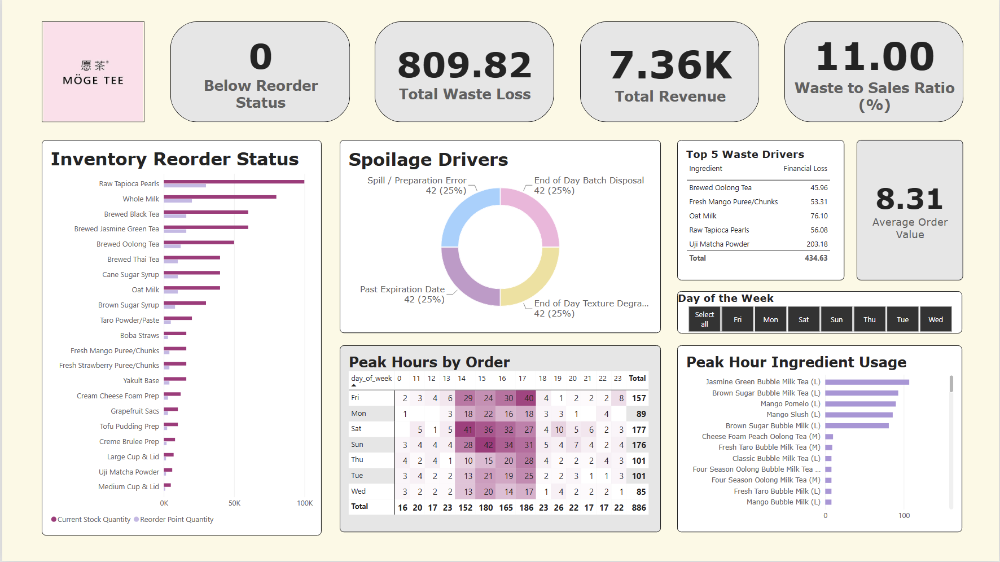
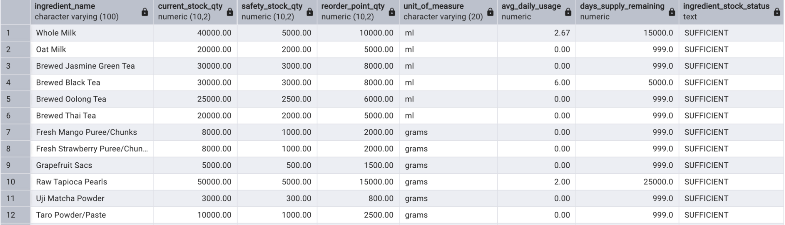
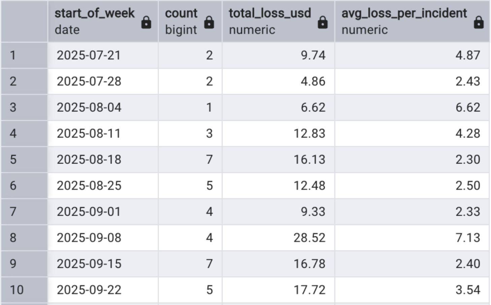
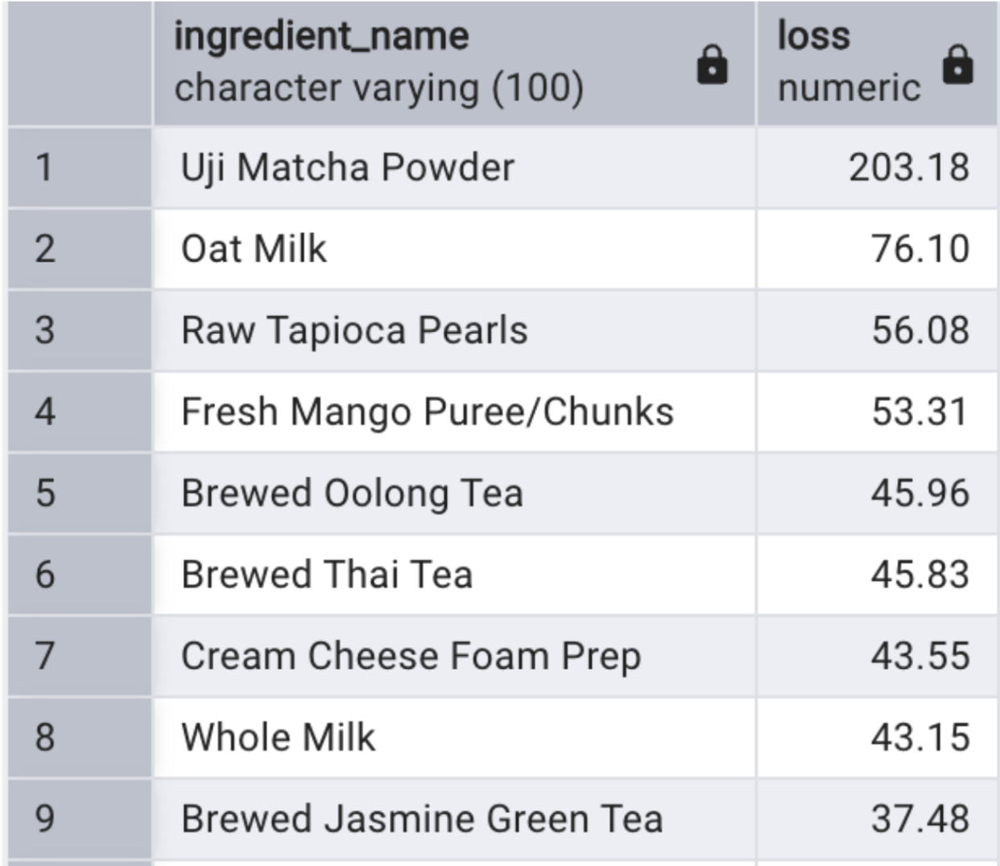
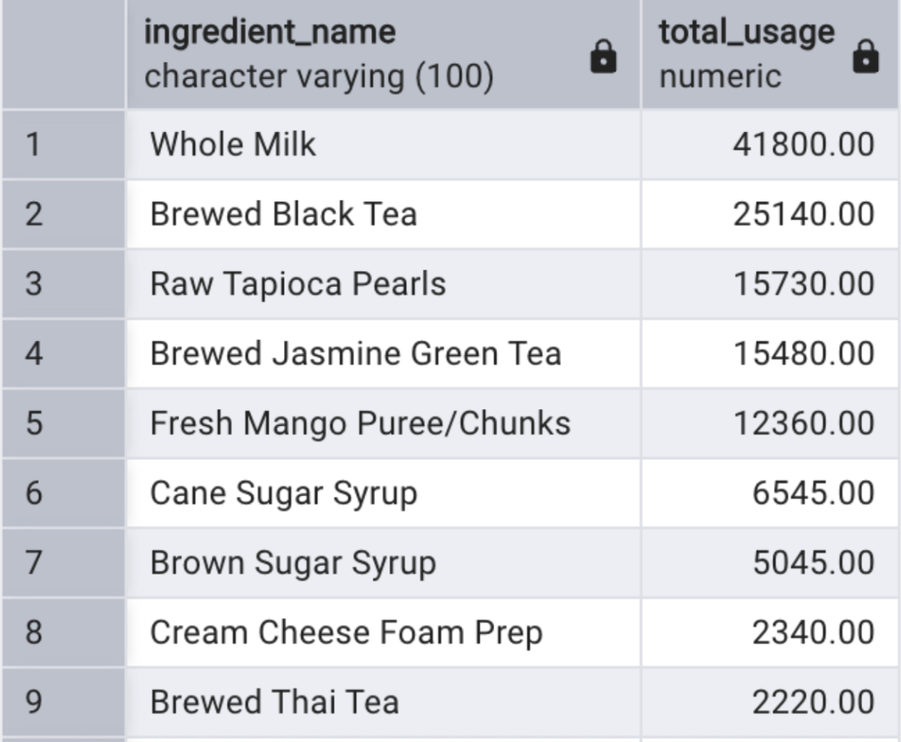
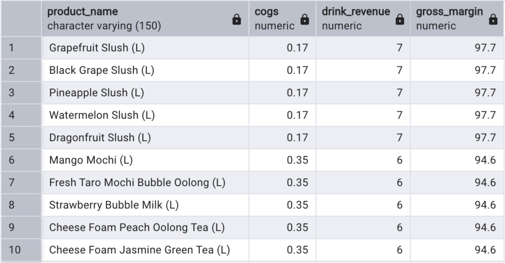

# Boba Shop Operations: Inventory Health & Waste Loss Analytics

# Project Overview
I work at a boba shop called Moge Tee and have noticed patterns in drink orders, waste at the end of the night, and common rush hours where my coworkers and I are scrambling to fulfill orders in time. Therefore, I thought it would be interesting to simulate a year of orders and provide my "manager" at this fictional boba shop with helpful business insights pulled from the data. 

I built this project to bridge what I see on the floor with data-driven operations. By simulating 1,200 transactions based on our real store operations and recipe ratios in PostgreSQL, I wanted to investigate these questions: 
* Which core ingredients are currently below safety stock levels, and how many days of inventory do we have left before we run out?
* How much revenue are we losing each week due to waste and which items cause the highest financial loss?
* Which specific raw ingredients experience the highest burn rate during peak weekend afternoon rushes (2:00-6:00PM)?
* Which menu drinks have the highest and lowest profit margins when accounting for raw ingredient costs?

# Data Architecture and Schema
* `orders`: Order transactions and timestamps.
* `order_items`: Line-item details capturing product associations and quantities sold.
* `products`: Master product catalog with retail pricing and category classification.
* `product_recipes`: Maps each beverage to required inventory ingredients and prep quantities.
* `inventory_items`: Current stock levels, unit measures, and reorder point thresholds.
* `waste_log`: Records of financial loss, logged disposal reasons, and ingredient scrap quantities.

# Dashboard Overview 

# Key Findings and Insights
Which core ingredients are currently below safety stock levels, and how many days of inventory do we have left before we run out?
* Finding: The Below Reorder Status KPI card confirmed 0 items currently below reorder thresholds, indicating no immediate stockout emergencies in the static baseline snapshot.

How much revenue are we losing each week due to waste and which items cause the highest financial loss?
* Finding: Across the simulated window, cumulative spoilage reached $809.82, yielding an elevated 11.00% Waste-to-Sales Ratio. On a weekly basis, total losses ranged between 6 and 28 dollars.
* Insight: The wide variance shows that kitchen prep is operating on fixed routines rather than adapting to actual customer foot traffic. Kitchen staff should scale down on slow weekdays to keep losses near the lower end of 6 dollars a week.

* Finding: The top three ingredients contributing to waste were Uji Matcha Powder, Oat Milk, and Raw Tapioca Pearls.
* Insight: Matcha Powder and Oat Milk should be ordered in lower quantities. For tapioca, the mid-day batch size should be decreased because sales die down after 6 pm.

Which specific raw ingredients experience the highest burn rate during peak weekend afternoon rushes (2:00-6:00PM)?
* Finding: Demand spikes sharply between 2-6PM on Friday, Saturday, and Sunday. The peak-hour sales distribution is dominated by Jasmine Green Bubble Milk Tea, Brown Sugar Bubble Milk Tea, and Mango Pomelo/Slush, driving burn on Raw Tapioca Pearls, Whole Milk, Brewed Green & Black Tea, and Mango Puree.
* Insight: Kitchen teams must schedule dedicated batch-brewing and tapioca boiling before this period to avoid stock outs.

Which menu drinks have the highest and lowest profit margins when accounting for raw ingredient costs?
* Finding: Evaluating the cost of goods sold against retail drink prices reveals exceptionally high gross margins across the menu. Fruit slushes lead at a top margin of 97.7% with other more complex drinks following closely behind.
* Insight: Since drinks with more toppings like cheese foam and mochi carry high spoilage risk if sales dip, avoid making large batches of these ingredients during the second half of the day.

## Recommendations & Next Steps
Based on the findings, three immediate interventions would improve store margins and kitchen workflow:

1. **Shift to Afternoon Micro-Batching:** Transition ingredient preparation from standard full-batches to half-batches after 6:00 PM to curb the $6–$28 weekly disposal spikes and drive the 11% waste ratio down.
2. **Standardize a 1:30 PM Pre-Rush Prep Schedule:** Begin fresh boba cooking and tea brewing prior to the 2:00 PM peak rush to prevent mid-service stock outs of top-selling drinks.
3. **Streamline Kitchen Assembly During Peak Surge:** With customer demand spiking to 40+ drinks per hour between 2:00 PM and 6:00 PM, cross-train floor staff to handle rush procedures.
   
## Tech Stack & Architecture

* **Relational Database:** PostgreSQL (Database modeling, multi-table joins, CTEs, window functions)
* **Business Intelligence:** Microsoft Power BI Desktop (DAX measures, interactive slicers, conditional formatting heat maps)

